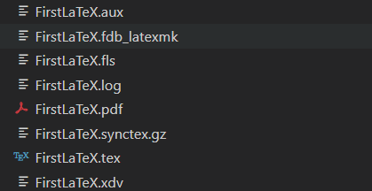
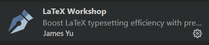

# LaTeX 学习

## LaTeX简介

与Microsoft Word或LibreOffice Writer等常见的文本处理器不同，LaTeX通常不提供所见即所得（“所见即所得”）。使用LaTeX，可以获取纯文本并用标记丰富它。这个标记告诉LaTeX文本某些元素的逻辑含义，类似于HTML的方式。
以表示 HTML 文档中新节的元素\<h2>为例。LaTeX 也有一个命令;这里将使用 \section 命令。

## LaTeX学习文档

[官方文档](https://www.learnlatex.org/en/)

## LaTeX系统

与许多计算机进程不同，LaTeX 不是一个包含“所有内容”的单一应用进程。相反，有单独的进程一起工作。我们可以将它们分为您实际需要的两件东西：

- TeX系统
- 文本编辑器

与LaTeX合作的核心是拥有可用的TeX系统。TeX 系统是使 LaTeX 工作所需的一组“幕后”进程和文档，但大多数时候你不会直接“运行”它。

目前有两种主要的TeX系统，MiKTeX和TeX Live。两者都可用于Windows，macOS和Linux。MiKTeX在Windows上拥有强大的背景;在macOS上，TeX Live被捆绑到一个名为MacTeX的更大集合中。每个系统都有优点，您可能想从 LaTeX 项目中查看更多建议。

由于TeX Live在所有常见平台上都可用，并且具有一些性能优势，因此如果您不确定要安装哪个系统，我们建议您选择TeX Live。

## LaTeX文件

## LaTeX在VS Code上编译

### 1、首先保证TeX live环境已经安装

### 2、安装必要插件

