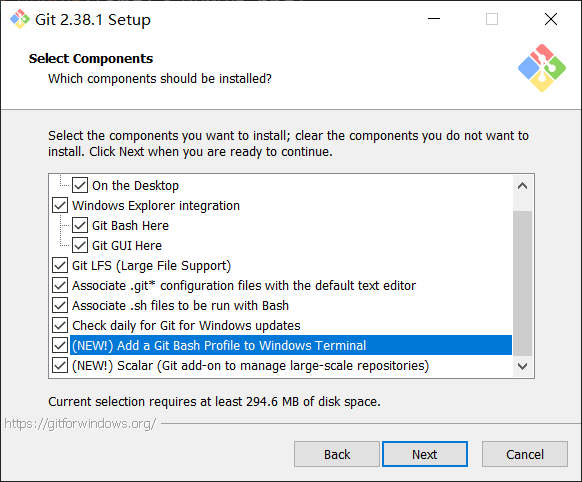

# Git 学习

## Git 下载网址

[Git for windows](https://gitforwindows.org/)

## Git 安装步骤

## 创建版本库repository

输入以下代码

~~~ bash
git init
~~~

## 添加文件到版本库

言归正传，现在我们编写一个readme.txt文件，内容如下：

Git is a version control system.
Git is free software.

### 1、用命令git add告诉Git，把文件添加到仓库

~~~ bash
git add readme.txt
~~~

### 2、用命令git commit告诉Git，把文件提交到仓库

~~~ bash
git commit -m "wrote a readme file"
~~~

简单解释一下git commit命令，-m后面输入的是本次提交的说明，可以输入任意内容，当然最好是有意义的，这样你就能从历史记录里方便地找到改动记录。

嫌麻烦不想输入-m "xxx"行不行？确实有办法可以这么干，但是强烈不建议你这么干，因为输入说明对自己对别人阅读都很重要。实在不想输入说明的童鞋请自行Google，我不告诉你这个参数。

git commit命令执行成功后会告诉你，1 file changed：1个文件被改动（我们新添加的readme.txt文件）；2 insertions：插入了两行内容（readme.txt有两行内容）。

### 为什么Git添加文件需要add，commit一共两步呢？

因为commit可以一次提交很多文件，所以你可以多次add不同的文件，比如：

~~~ bash
git add file1.txt
git add file2.txt file3.txt
git commit -m "add 3 files."
~~~

### 添加总结

使用命令git add \<file>，注意，可反复多次使用，添加多个文件；
使用命令git commit -m \<message>，完成。

## 时光穿梭机（本地仓库进行版本控制）

### 查看状态（已修改|未修改

~~~ bash
git status
~~~

### 查看修改了什么（与源文件的差异）

~~~ bash
git diff readme.txt
~~~

### 查看修改日志

有点类似于Linux打开一个文本文件，按q退出

~~~ bash
git log
~~~

~~~ bash
git log --pretty=oneline
~~~

### 版本回退

首先，Git必须知道当前版本是哪个版本，在Git中，用HEAD表示当前版本，也就是最新的提交1094adb...（注意我的提交ID和你的肯定不一样），上一个版本就是HEAD^，上上一个版本就是HEAD^^，当然往上100个版本写100个^比较容易数不过来，所以写成HEAD~100。
***回到过去***

~~~ bash
git reset --hard HEAD^
~~~

***去到某个时间点，可以是未来、过去***

~~~ bash
git reset --hard f42d0265cd66a8bdffdcab8684a604e578e73fe7
~~~

回到过去git就会把现在的版本删掉，想要回去怎么办？
reflog会记录下删掉的东西

~~~bash
git reflog
~~~

### 撤回修改

让这个文件回到最近一次git commit或git add时的状态。

~~~bash
git checkout -- readme.txt
~~~

撤回暂存区修改(不小心add到暂存区了，要赶紧撤回免得被人看到)
git reset命令既可以回退版本，也可以把暂存区的修改回退到工作区。当我们用HEAD时，表示最新的版本。

~~~bash
git reset HEAD readme.txt
~~~

### 从版本库删除文件

当用add添加一个文件到暂存区的时候，并且提交到版本库了，然后你用删除命令把这个文件删除了。这个操作也算修改操作。此时，如果你真的是要把这个文件从版本库中删除，就用

~~~bash
git rm readme.txt
~~~

那么你的这个文件就会从版本库repository中消失

如果你是误删除，那么可以用

~~~bash
git checkout -- readme.txt
~~~

让这个文件回到最近一次git commit或git add时的状态。

### 时光穿梭总结

场景1：当你改乱了工作区某个文件的内容，想直接丢弃工作区的修改时，用命令git checkout -- file。

场景2：当你不但改乱了工作区某个文件的内容，还添加到了暂存区时，想丢弃修改，分两步，第一步用命令git reset HEAD \<file>，就回到了场景1，第二步按场景1操作。

场景3：已经提交了不合适的修改到版本库时，想要撤销本次提交，参考版本回退一节，不过前提是没有推送到远程库。

## 远程仓库

### 创建SSH密钥

~~~bash
ssh-keygen -t rsa -C "ln18520340281@163.com"
~~~

其中id_rsa是私钥，不能给别人
id_rsa.pub是公钥，可以给别人

### 登录GitHub，打开账户设置

### 点击添加SSH密钥，填上任意标题

### 刚新建的仓库没有分支，新建一个

~~~bash
git branch -M master
~~~

### 配置本地仓库用户名和邮箱

~~~bash
git config --global user.name "lenny"
git config --global user.email "ln18520340281@163.com"
~~~

### 把本地仓库的修改add到远程仓库暂存区

第一个参数远程仓库名 远程仓库SSH地址

~~~bash
git remote add FirstRemoteRepository git@gitee.com:lennylovecode/hello-world.git

git remote add SecondRepo  git@github.com:ln18520340281/Hello-World.git
~~~

查看

~~~bash
git remote -v
~~~

### 推送暂存区内容到远程仓库

~~~bash
git push -u FirstRemoteRepository "master"
~~~

由于远程库是空的，我们第一次推送master分支时，加上了-u参数，Git不但会把本地的master分支内容推送的远程新的master分支，还会把本地的master分支和远程的master分支关联起来，在以后的推送或者拉取时就可以简化命令。

### 克隆命令

~~~bash
git clone git@gitee.com:lennylovecode/hello-world.git
~~~

## 分支

### 创建分支

~~~bash
git branch dev
~~~

### 查看当前分支

~~~bash
git branch
~~~

### 切换分支

~~~bash
git checkout dev
~~~

或者

~~~bash
git switch dev
~~~

### 合并分支（把参数分支和当前分支合并）

~~~bash
git merge dev
~~~

## 问题集

### git bash中文无法正常显示，只显示为数字

解决：

***core.quotePath***
>Commands that output paths (e.g. ls-files, diff), will quote "unusual" characters in the pathname by enclosing the pathname in double-quotes and escaping those characters with backslashes in the same way C escapes control characters (e.g. \t for TAB, \n for LF, \\ for backslash) or bytes with values larger than 0x80 (e.g. octal \302\265 for "micro" in UTF-8). If this variable is set to false, bytes higher than 0x80 are not considered "unusual" any more. Double-quotes, backslash and control characters are always escaped regardless of the setting of this variable. A simple space character is not considered "unusual". Many commands can output pathnames completely verbatim using the -z option. The default value is true.

~~~bash
git config --global core.quotepath false
~~~
