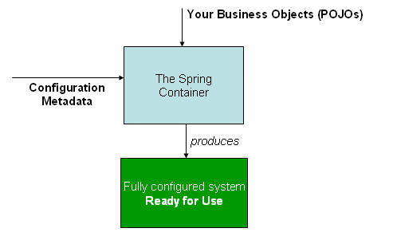

# Spring Framework之Ioc

## Ioc和Bean

本章涵盖控制反转 (IoC) 原则的 Spring Framework 实现。 IoC 也称为依赖注入 (DI)。在这个过程中，对象仅通过构造函数参数、工厂方法的参数或在对象实例被构造或从工厂方法返回后设置的属性来定义它们的依赖关系（即它们使用的其他对象）。然后容器在创建 bean 时注入这些依赖项。这个过程基本上是 bean 本身的逆过程（因此得名控制反转），它通过使用类的直接构造或服务定位器模式等机制来控制其依赖项的实例化或位置。

以上这些和包是 Spring Framework 的 IoC 容器的基础。 BeanFactory 接口提供了一种高级配置机制，能够管理任何类型的对象。 ApplicationContext 是一个子接口。它增加了：org.springframework.beansorg.springframework.contextBeanFactory

- 更容易与 Spring 的 AOP 特性集成

- 消息资源处理（用于国际化）

- 活动发布

- 应用层特定的上下文，例如用于 Web 应用进程的 WebApplicationContext

简而言之，它提供了配置框架和基本功能，并添加了更多企业特定的功能。是以上功能的完整超集，本章专门用于描述 Spring 的 IoC 容器。有关使用而不是的更多信息，请参阅涵盖 BeanFactory API.BeanFactoryApplicationContextApplicationContextBeanFactoryBeanFactoryApplicationContext 的部分，

在 Spring 中，构成应用进程主干并由 Spring IoC 容器管理的对象称为 bean。 bean 是由 Spring IoC 容器实例化、组装和管理的对象。否则，bean 只是应用进程中众多对象中的一个。 Bean 以及它们之间的依赖关系反映在容器使用的配置metadata中。

## 容器概述

org.springframework.context.ApplicationContext该接口表示 Spring IoC 容器，负责实例化、配置和组装 bean。容器通过读取配置metadata获取有关要实例化、配置和组装哪些对象的指令。配置metadata以 XML、Java 注释或 Java 代码表示。它允许您表达组成应用进程的对象以及这些对象之间丰富的相互依赖关系。

Spring 提供了该接口的多个实现。在独立应用进程中，通常创建 ClassPathXmlApplicationContext 或 FileSystemXmlApplicationContext 的实例。虽然 XML 一直是定义配置metadata的传统格式，但您可以通过提供少量 XML 配置来指示容器使用 Java 注释或代码作为metadata格式，以声明方式启用对这些额外metadata格式的支持。ApplicationContext

在大多数应用场景中，不需要显式的用户代码来实例化一个或多个 Spring IoC 容器实例。例如，在 Web 应用进程场景中，应用进程文档中简单的八（或左右）行样板 Web 描述符 XML 通常就足够了（请参阅 Web 应用进程的便捷 ApplicationContext 实例化）。如果您使用 Spring Tools for Eclipse（一个由 Eclipse 驱动的开发环境），您可以通过单击几下鼠标或击键轻松创建此样板配置web.xml

下图显示了 Spring 工作原理的高级视图。您的应用进程类与配置metadata相结合，以便在创建和初始化后，您拥有一个完全配置且可执行的系统或应用进程。

### 配置Metadata
