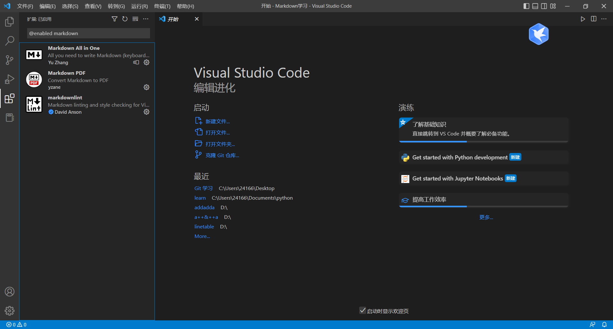

# 第一章 MarkDown学习

## 1. 官方文档网址

[官方文档网址](https://markdown.com.cn/)

## 2. vscode必要插件

1、yzhang.markdown-all-in-one

markdown语法支持插件

2、DavidAnson.vscode-markdownlint

markdown语法规范插件

3、yzane.markdown-pdf

markdown输出插件

## 3.markdown语法

### 图片

~~~markdown

~~~

### 链接

~~~markdown
[替换文本](链接路径)
~~~

### 引用块

~~~markdown
> 引用内容
~~~
