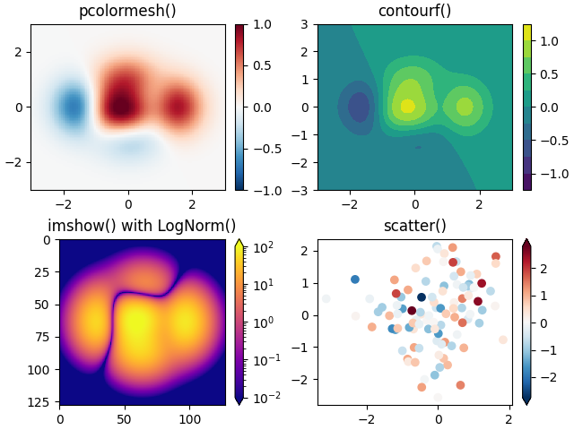

# 快速开始

本教程介绍了一些基本的使用模式和最佳实践 帮助您开始使用 Matplotlib。

~~~python
import matplotlib as mpl
import matplotlib.pyplot as plt
import numpy as np
~~~

## 1.一个简单的例子

Matplotlib 在Figures 上绘制您的数据（例如，Windows、Jupyter 小部件等），可以根据 x-y 坐标指定点的区域（或极坐标图中的 theta-r，3D 图中的 x-y-z 等）。最简单的方法创建带有轴的图形是使用pyplot.subplots。然后，我们可以使用Axes.plot在轴上绘制一些数据：

~~~python
fig, ax = plt.subplots()  # 创建一个包含单个轴的图窗。

ax.plot([1, 2, 3, 4], [1, 4, 2, 3]);  # 在轴上绘制一些数据。
~~~

## 2.图的部分

这是 Matplotlib 图的组成部分。

### 第一个成分：Figure（画布）

整个图。Figure跟踪所有子轴（child Axes）、一组“特殊”艺术成分（标题、图形图例、颜色条等），甚至嵌套子图形。

创建新图形的最简单方法是使用pyplot：

~~~python
fig = plt.figure()  # 没有轴的空图
fig, ax = plt.subplots()  # 具有单轴的图形
fig, axs = plt.subplots(2, 2)  # 具有 2x2 轴网格的图形
~~~

将轴与Figure一起创建通常很方便，但您也可以稍后手动添加轴。请注意，许多 Matplotlib 后端支持在图形窗口上进行缩放和平移。

### 第二个成分：Axes(数组轴)

轴是附加到图形的渲染成分，该成分包含用于绘制数据的区域，通常包括两个（在3D的情况下为三个）刻度轴（Axis）对象（请注意Axes和Axis之间的差异），这些对象提供刻度和刻度标签，为轴中的数据提供刻度。每个轴还有一个标题（通过 set_title（）设置）、一个x标签（通过set_xlabel（）设置）和一个通过set_ylabel（）设置的 y 标签）。

Axes 类及其成员函数是使用 OOP 接口的主要入口点，并且在其上定义了大多数绘图方法（例如，如上所示的 ax.plot（） 使用绘图方法）

### 第三个成分：Axis（数组坐标轴）axis0垂直 axis1水平

这些对象设置刻度和限制，并生成刻度（轴上的标记）和刻度标签（标记刻度的字符串）。刻度的位置由定位器（Locator）对象确定，刻度标签字符串由格式化（Formatter）进程格式化。正确的定位器（Locator）和格式化（Formatter）进程的组合可以非常精细地控制刻度位置和标签。

### 第四个成分：Artist（渲染成份）

基本上，图形上可见的所有内容都是渲染成分（甚至是图形，轴和轴对象）。这包括文本Text对象、Line2D 对象、集合collections对象、补丁Patch对象等。渲染图形时，所有渲染成分都会被绘制到画布（canvas）上。大多数渲染成分都绑定在坐标轴（Axes）上;这样的渲染成分不能由多个坐标轴（Axes）共享，也不能从一个坐标轴移动到另一个坐标轴。

## 3.绘图函数的输入类型

绘图函数需要 numpy.array 或 numpy.ma.masked_array 作为输入，或者需要可以传递给 numpy.asarray 的对象。类似于数组（“类数组”）的类，如 pandas 数据对象和 numpy.matrix，可能无法按预期工作。常见的约定是在绘制之前将它们转换为 numpy.array 对象。例如，要转换 numpy.matrix

~~~python
b = np.matrix([[1, 2], [3, 4]])
b_asarray = np.asarray(b)
~~~

大多数方法还将解析可寻址的对象，如字典（dict）、numpy.recarray 或 pandas.DataFrame。Matplotlib 允许您提供data关键字参数并生成传递对应于 x 和 y 变量的字符串的图。

~~~python
np.random.seed(19680801)  # 为随机数生成器设定种子。
data = {'a': np.arange(50),
        'c': np.random.randint(0, 50, 50),
        'd': np.random.randn(50)}
data['b'] = data['a'] + 10 * np.random.randn(50)
data['d'] = np.abs(data['d']) * 100

fig, ax = plt.subplots(figsize=(5, 2.7), layout='constrained')
ax.scatter('a', 'b', c='c', s='d', data=data) # 散点图
ax.set_xlabel('entry a')
ax.set_ylabel('entry b');
~~~

## 4.代码风格

显式接口和隐式接口 如上所述，使用 Matplotlib 基本上有两种方法：

- 显式创建图形和轴，并对其调用方法（“面向对象（OO）风格”）。
- 依靠 pyplot 隐式创建和管理图形和轴，并使用 pyplot 函数进行绘图。

请参阅 Matplotlib 应用进程接口 （API），了解隐式接口和显式接口之间的权衡说明。

所以你可以使用面向对象风格

~~~python
x = np.linspace(0, 2, 100)  # 示例数据。

'''
请注意，即使在面向对象样式中，我们也使用 '.pyplot.figure' 来创建 Figure。
'''

fig, ax = plt.subplots(figsize=(5, 2.7), layout='constrained')
ax.plot(x, x, label='linear')  # 在轴上绘制一些数据。
ax.plot(x, x**2, label='quadratic')  # 在轴上绘制更多数据...
ax.plot(x, x**3, label='cubic')  # ... 还有更多.
ax.set_xlabel('x label')  # 向坐标轴添加 x 标签。
ax.set_ylabel('y label')  # 向坐标轴添加 y 标签。
ax.set_title("Simple Plot")  # 向坐标轴添加标题。
ax.legend()  # 添加图例(legend)
~~~

也可以使用pyplot风格

~~~python
x = np.linspace(0, 2, 100)  # 样例数据

plt.figure(figsize=(5, 2.7), layout='constrained')
plt.plot(x, x, label='linear')  # 在（隐式）坐标轴上绘制一些数据。
plt.plot(x, x**2, label='quadratic')  # 例如
plt.plot(x, x**3, label='cubic')
plt.xlabel('x label')
plt.ylabel('y label')
plt.title("Simple Plot")
plt.legend()
~~~

（此外，还有第三种方法，用于在GUI应用进程中嵌入Matplotlib的情况，它完全删除pyplot，即使对于图形创建也是如此。有关详细信息，请参阅库中的相应部分：在图形用户界面中嵌入 Matplotlib。

Matplotlib的文档和示例同时使用OO和pyplot样式。通常，我们建议使用 OO 样式，特别是对于复杂的绘图，以及旨在作为较大项目的一部分重用的函数和脚本。但是，pyplot 样式对于快速交互式工作非常方便。

***注意***：
您可能会找到使用 pylab 接口的旧示例——from pylab import *。此方法已强烈弃用。

## 5.写一个更有帮助的函数

如果您需要使用不同的数据一遍又一遍地制作相同的图 集合，或者想要轻松包装 Matplotlib 方法，使用推荐的 签名功能如下。

~~~python
def my_plotter(ax, data1, data2, param_dict):
    """
    用于制作图形的帮助进程函数。
    """
    out = ax.plot(data1, data2, **param_dict)
    return out
~~~

然后，您将使用两次来填充两个子图：

~~~python
data1, data2, data3, data4 = np.random.randn(4, 100)  # 制作 4 个随机数据集
fig, (ax1, ax2) = plt.subplots(1, 2, figsize=(5, 2.7))
my_plotter(ax1, data1, data2, {'marker': 'x'})
my_plotter(ax2, data3, data4, {'marker': 'o'})
~~~

>请注意，如果您想将它们安装为 python 包或任何其他 您可以使用网络上众多模板之一的自定义; Matplotlib在mpl-cookiecutter上有一个

## 6.个性化渲染

大多数绘图方法都有渲染成分的样式选项，可以访问当调用绘图方法时，或从渲染成份的“setter”调用。在下面的图我们手动设置颜色、线宽和线型。渲染成分由plot创建，我们用set_linestyle来设第二条线的样式置

~~~python
fig, ax = plt.subplots(figsize=(5, 2.7))
x = np.arange(len(data1))
ax.plot(x, np.cumsum(data1), color='blue', linewidth=3, linestyle='--')
l, = ax.plot(x, np.cumsum(data2), color='orange', linewidth=2)
l.set_linestyle(':')
~~~

## 7.颜色

Matplotlib 具有非常灵活的颜色数组，大多数可渲染的成分都可以接受这些颜色;有关规格列表，请参阅颜色教程。有些渲染会采用多种颜色。即对于散点图，标记的边缘可以是与内部不同的颜色：

~~~python
fig, ax = plt.subplots(figsize=(5, 2.7))
ax.scatter(data1, data2, s=50, facecolor='C0', edgecolor='k')
~~~

## 8.线宽、线型和标记大小

线宽通常以排版点 （1 pt = 1/72 英寸） 为单位，可用于具有描边线条的渲染。同样，描边线可以具有线型。请参阅线型示例。

标记大小取决于所使用的方法。plot 以磅为单位指定标记大小，通常是标记的“直径”或宽度。scatter 指定标记大小与标记的可视区域大致成比例。有一组标记样式可用作字符串代码（请参阅标记），或者用户可以定义自己的标记样式（请参阅标记参考）：

~~~python
fig, ax = plt.subplots(figsize=(5, 2.7))
ax.plot(data1, 'o', label='data1')
ax.plot(data2, 'd', label='data2')
ax.plot(data3, 'v', label='data3')
ax.plot(data4, 's', label='data4')
ax.legend()
~~~

## 9.图的标签

### 坐标轴标签和文本

set_xlabel、set_ylabel 和 set_title 用于在指示的位置添加文本（有关更多讨论，请参阅 Matplotlib 图中的文本）。也可以使用文本将文本直接添加到绘图中：

~~~python
mu, sigma = 115, 15
x = mu + sigma * np.random.randn(10000)
fig, ax = plt.subplots(figsize=(5, 2.7), layout='constrained')
'''数据的直方图（histogram）'''
n, bins, patches = ax.hist(x, 50, density=True, facecolor='C0', alpha=0.75)

ax.set_xlabel('Length [cm]')
ax.set_ylabel('Probability')
ax.set_title('Aardvark lengths\n (not really)')
ax.text(75, .025, r'$\mu=115,\ \sigma=15$')
ax.axis([55, 175, 0, 0.03])
ax.grid(True)
~~~

所有文本函数都返回一个 matplotlib.text.Text 实例。与上面的行一样，您可以通过将关键字参数传递到文本函数中来自定义属性：

~~~python
t = ax.set_xlabel('my data', fontsize=14, color='red')
~~~

文本属性和布局中更详细地介绍了这些属性。

### 在文本中使用数学表达式

Matplotlib 接受任何文本表达式中的 TeX 方程表达式。例如，要在标题中编写σi=15表达式，您可以编写一个用美元符号包围的 TeX 表达式：

~~~python
ax.set_title(r'$\sigma_i=15$')
~~~

其中标题字符串前面的 r 表示字符串是原始字符串，而不是将反斜杠视为 python 转义。Matplotlib 具有内置的 TeX 表达式解析器和布局引擎，并附带自己的数学字体 – 有关详细信息，请参阅编写数学表达式。您还可以直接使用 LaTeX 格式化文本，并将输出直接合并到显示图形或保存的后记中 – 请参阅使用 LaTeX 进行文本渲染。

### 注释

我们还可以在图上注释点，通常是通过将指向 xy 的箭头连接到 xytext 处的一段文本：

~~~python
fig, ax = plt.subplots(figsize=(5, 2.7))

t = np.arange(0.0, 5.0, 0.01)
s = np.cos(2 * np.pi * t)
line, = ax.plot(t, s, lw=2)

ax.annotate('local max', xy=(2, 1), xytext=(3, 1.5),
            arrowprops=dict(facecolor='black', shrink=0.05))

ax.set_ylim(-2, 2)
~~~

在此基本示例中，xy 和 xytext 都在数据坐标中。还可以选择多种其他坐标系 - 有关详细信息，请参阅基本注记和高级注记。更多示例也可以在注释图中找到。

### 图例

通常，我们希望使用Axes.legend来识别线条或标记：

~~~python
fig, ax = plt.subplots(figsize=(5, 2.7))
ax.plot(np.arange(len(data1)), data1, label='data1')
ax.plot(np.arange(len(data2)), data2, label='data2')
ax.plot(np.arange(len(data3)), data3, 'd', label='data3')
ax.legend()
~~~

Matplotlib 中的图例在布局、位置以及它们可以代表的渲染方面非常灵活。它们在图例指南中有详细讨论。

## 10.坐标轴刻度

每个坐标轴都有两个（或三个）表示 x 轴和 y 轴的轴对象。它们控制刻度轴、刻度定位器和刻度格式化进程的比例。可以附加其他轴以显示更多轴对象。

### 刻度

除了线性刻度，Matplotlib还提供非线性刻度，例如对数刻度。由于对数刻度的使用如此之多，因此也有直接的方法，如对数、分数和分数。有许多刻度（有关其他示例，请参阅刻度）。在这里，我们手动设置比例：

~~~python
fig, axs = plt.subplots(1, 2, figsize=(5, 2.7), layout='constrained')
xdata = np.arange(len(data1))  # 为此制作序数
data = 10**data1
axs[0].plot(xdata, data)

axs[1].set_yscale('log')
axs[1].plot(xdata, data)
~~~

刻度设置从数据值到沿轴间距的映射。这在两个方向上发生，并组合成一个转换，这是 Matplotlib 从数据坐标映射到轴、图形或屏幕坐标的方式。请参阅转换教程。

### 刻度定位器和格式化进程

每个轴都有一个刻度定位器和格式化进程，用于选择沿 Axis 对象放置刻度线的位置。一个简单的界面是set_xticks：

~~~python
fig, axs = plt.subplots(2, 1, layout='constrained')
axs[0].plot(xdata, data1)
axs[0].set_title('Automatic ticks')

axs[1].plot(xdata, data1)
axs[1].set_xticks(np.arange(0, 100, 30), ['zero', '30', 'sixty', '90'])
axs[1].set_yticks([-1.5, 0, 1.5])  # 请注意，我们不需要指定标签
axs[1].set_title('Manual ticks')
~~~

不同的比例可以有不同的定位器和格式化进程;例如，上面的对数刻度使用LogLocator和LogFormatter。有关其他格式化进程和定位器的信息，请参阅刻度定位器和刻度格式化进程，以及编写自己的定位器的信息。

### 绘制日期和字符串

Matplotlib可以处理绘制日期数组和字符串数组，以及浮点数。它们会根据需要获得特殊的定位器和格式化进程。对于日期：

~~~python
fig, ax = plt.subplots(figsize=(5, 2.7), layout='constrained')
dates = np.arange(np.datetime64('2021-11-15'), np.datetime64('2021-12-25'),
                  np.timedelta64(1, 'h'))
data = np.cumsum(np.random.randn(len(dates)))
ax.plot(dates, data)
cdf = mpl.dates.ConciseDateFormatter(ax.xaxis.get_major_locator())
ax.xaxis.set_major_formatter(cdf)
~~~

有关更多信息，请参阅日期示例（例如日期刻度标签）
对于字符串，我们得到分类绘图（参见：绘制分类变量）。

~~~python
fig, ax = plt.subplots(figsize=(5, 2.7), layout='constrained')
categories = ['turnips', 'rutabaga', 'cucumber', 'pumpkins']

ax.bar(categories, np.random.rand(len(categories)))
~~~

### 其他轴对象

在一个图表中绘制不同量级的数据可能需要额外的 y 轴。可以通过使用 twinx 添加一个新坐标轴来创建这样的轴，该坐标轴具有不可见的 x 轴和位于右侧的 y 轴（类似于 twiny）。有关另一个示例，请参阅具有不同比例的绘图。

同样，您可以添加与主轴比例不同的secondary_xaxis或secondary_yaxis，以表示不同比例或单位的数据。有关更多示例，请参阅辅助轴。

~~~python
fig, (ax1, ax3) = plt.subplots(1, 2, figsize=(7, 2.7), layout='constrained')
l1, = ax1.plot(t, s)
ax2 = ax1.twinx()
l2, = ax2.plot(t, range(len(t)), 'C1')
ax2.legend([l1, l2], ['Sine (left)', 'Straight (right)'])

ax3.plot(t, s)
ax3.set_xlabel('Angle [rad]')
ax4 = ax3.secondary_xaxis('top', functions=(np.rad2deg, np.deg2rad))
ax4.set_xlabel('Angle [°]')
~~~

## 11.彩色映射数据

通常，我们希望在由颜色图中的颜色表示的图中具有第三维。Matplotlib 有许多绘图类型可以做到这一点：

~~~python
X, Y = np.meshgrid(np.linspace(-3, 3, 128), np.linspace(-3, 3, 128))
Z = (1 - X/2 + X**5 + Y**3) * np.exp(-X**2 - Y**2)

fig, axs = plt.subplots(2, 2, layout='constrained')
pc = axs[0, 0].pcolormesh(X, Y, Z, vmin=-1, vmax=1, cmap='RdBu_r')
fig.colorbar(pc, ax=axs[0, 0])
axs[0, 0].set_title('pcolormesh()')

co = axs[0, 1].contourf(X, Y, Z, levels=np.linspace(-1.25, 1.25, 11))
fig.colorbar(co, ax=axs[0, 1])
axs[0, 1].set_title('contourf()')

pc = axs[1, 0].imshow(Z**2 * 100, cmap='plasma',
                          norm=mpl.colors.LogNorm(vmin=0.01, vmax=100))
fig.colorbar(pc, ax=axs[1, 0], extend='both')
axs[1, 0].set_title('imshow() with LogNorm()')

pc = axs[1, 1].scatter(data1, data2, c=data3, cmap='RdBu_r')
fig.colorbar(pc, ax=axs[1, 1], extend='both')
axs[1, 1].set_title('scatter()')
~~~

### 色彩图

这些都是派生自 ScalarMappable 对象的渲染示例。它们都可以将 vmin 和 vmax 之间的线性映射设置为由 cmap 指定的颜色图。Matplotlib有许多颜色图可供选择（在Matplotlib中选择颜色图），您可以自己制作（在Matplotlib中创建颜色图）或作为第三方软件包下载。

### 规范化

有时我们希望将数据非线性映射到颜色图，如上面的 LogNorm 示例所示。我们通过为 ScalarMappable 提供 norm 参数而不是 vmin 和 vmax 来做到这一点。颜色图规范化中显示了更多规范化。

### 颜色条

添加colorbar提供了将颜色关联回基础数据的键。颜色条是图形级别的渲染，并附加到ScalarMappable（他们在其中获取有关规范和颜色图的信息），并且通常从父轴窃取空间。颜色条的放置可能很复杂：有关详细信息，请参阅放置颜色条。您还可以使用 extend 关键字更改颜色条的外观，以在末端添加箭头，并缩小和纵横以控制大小。最后，颜色条将具有适合规范的默认定位器和格式化进程。可以像更改其他安讯士对象一样更改这些对象。

## 12.使用多个图形和轴

您可以通过多次调用 fig = plt.figure（） 或 fig2， ax = plt.subplots（） 打开多个图形。通过保留对象引用，您可以将渲染成份添加到任一图形中。

可以通过多种方式添加多个轴，但最基本的是上面使用的 plt.subplots（）。可以使用subplot_mosaic实现更复杂的布局，Axes 对象跨越列或行。

~~~python
fig, axd = plt.subplot_mosaic([['upleft', 'right'],
                               ['lowleft', 'right']], layout='constrained')
axd['upleft'].set_title('upleft')
axd['lowleft'].set_title('lowleft')
axd['right'].set_title('right')
~~~

Matplotlib 有相当复杂的工具来排列轴：请参阅在图形中排列多个轴和复杂和语义图形组合。
