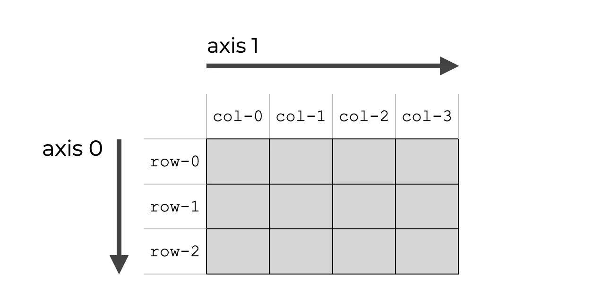

# 速查表

## 基础

### axes

axes：数组的维度

### axis

axis:矩阵的轴（axis0是垂直与行的，axis1是垂直于列的轴）见下图

### linspace

numpy.linspace(start, stop, num=50, endpoint=True, retstep=False, dtype=None, axis=0)
**start**:起点
**stop**:终点
**num**:间隔数
**endpoint**:是否包括终点，默认为True
**retstep**:如果为 True，则返回 （样本，步长），其中步长是样本之间的间距。
**dtype**:输出数组的类型。如果未给定 dtype，则从开始和停止推断数据类型。推断的 dtype 永远不会是整数;即使参数将生成整数数组，也会选择 float。
**axis**:结果中用于存储样本的轴。仅当启动或停止类似于数组时才相关。默认情况下 （0），样本将沿着开头插入的新轴。使用 -1 获取末尾的轴。

返回指定间隔内均匀分布的数字。

~~~python
import matplotlib.pyplot as plt
import numpy as np

N = 8
y = np.zeros(N)
x1 = np.linspace(0, 10, N, endpoint=True)
x2 = np.linspace(0, 10, N, endpoint=False)
plt.plot(x1, y, 'o')
plt.plot(x2, y + 0.5, 'o')

plt.ylim([-0.5, 1])  # 设置y的范围
plt.show()
~~~

