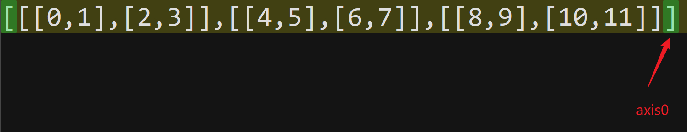
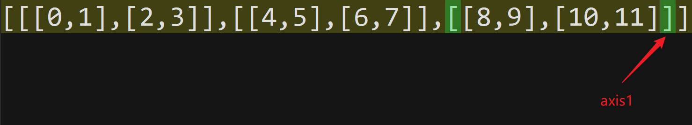
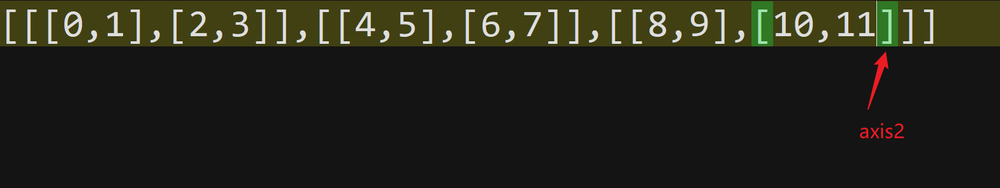
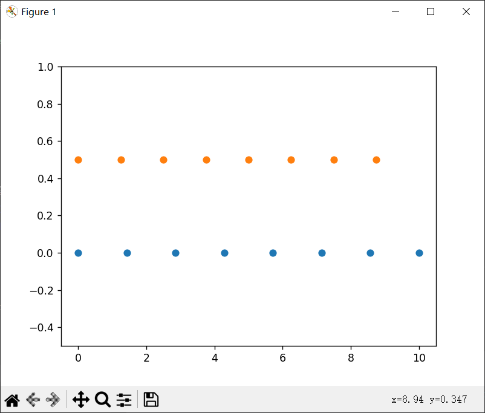

# 速查表

## 基础

### axes

axes：数组的维度

### axis

~~~python
import numpy as np
a = np.arange(12).reshape(3,2,2)
print("数组",a)
print("维度: ",a.ndim) # a数组的维度
print("形状: ",a.shape,end="\n\n") # b的形状

sum0 = a.sum(axis=0)
sum1 = a.sum(axis=1)
sum2 = a.sum(axis=2)
'''
sum0 = a.sum(axis=0,keepdims=True)
sum1 = a.sum(axis=1,keepdims=True)
sum2 = a.sum(axis=2,keepdims=True)

如果设置了keepdims=True,就不会自动删除括号，如参数名，保持维度的意思
[[[0,1],[2,3]],[[4,5],[6,7]],[[8,9],[10,11]]]
sum的结果
axis0       [[[12,15],[18,21]]]
axis1       [[[2,4],[10,12],[[18,20]]]
axis2       [[[1],[5]],[[9],[13]],[[17],[21]]]

sum0 = a.sum(axis=0)
sum1 = a.sum(axis=1)
sum2 = a.sum(axis=2)

如果keepdims是默认，则会把多余的括号删掉，因为数组内加会降维。其中axisi对应sum的结果是把[数组维度-i]维数组的括号删掉，axis1则把二维数组的括号删掉.....以此类推
[[[0,1],[2,3]],[[4,5],[6,7]],[[8,9],[10,11]]]
sum的结果
axis0       [[[12,15],[18,21]]]把3维数组的括号删掉→[[12,15],[18,21]]
axis1       [[[2,4],[10,12],[[18,20]]]删去2维→[[2,4],[10,12],[[18,20]]
axis2       [[[1],[5]],[[9],[13]],[[17],[21]]]删去1维→[[1,5],[9,13]],[17,21]]
'''

print(sum0,end="\n\n")
print(sum1,end="\n\n")
print(sum2,end="\n\n")
~~~

每层数组的括号都代表着不同层次的数组，而sum函数则是把同一层次的数组相加

### linspace

numpy.linspace(start, stop, num=50, endpoint=True, retstep=False, dtype=None, axis=0)
**start**:起点
**stop**:终点
**num**:间隔数
**endpoint**:是否包括终点，默认为True
**retstep**:如果为 True，则返回 （样本，步长），其中步长是样本之间的间距。
**dtype**:输出数组的类型。如果未给定 dtype，则从开始和停止推断数据类型。推断的 dtype 永远不会是整数;即使参数将生成整数数组，也会选择 float。
**axis**:结果中用于存储样本的轴。仅当启动或停止类似于数组时才相关。默认情况下 （0），样本将沿着开头插入的新轴。使用 -1 获取末尾的轴。

返回指定间隔内均匀分布的数字。

~~~python
import matplotlib.pyplot as plt
import numpy as np

N = 8
y = np.zeros(N)
x1 = np.linspace(0, 10, N, endpoint=True)
x2 = np.linspace(0, 10, N, endpoint=False)
plt.plot(x1, y, 'o')
plt.plot(x2, y + 0.5, 'o')

plt.ylim([-0.5, 1])  # 设置y的范围
plt.show()
~~~

