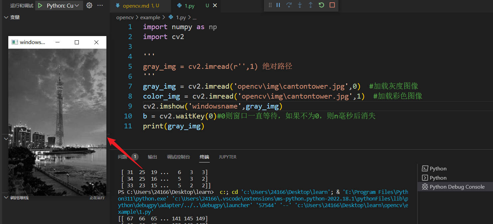

# open cv 学习

## 图像处理

### 读一个图

~~~python
import numpy as np
import cv2

'''
gray_img = cv2.imread(r'',1) 绝对路径
'''
gray_img = cv2.imread('opencv\img\cantontower.jpg',0)  #加载灰度图像
color_img = cv2.imread('opencv\img\cantontower.jpg',1)  #加载彩色图像
cv2.imshow('窗口名字',gray_img)
b = cv2.waitKey(0)#0则窗口一直等待，如果不为0，则n毫秒后消失
print(gray_img)
~~~

